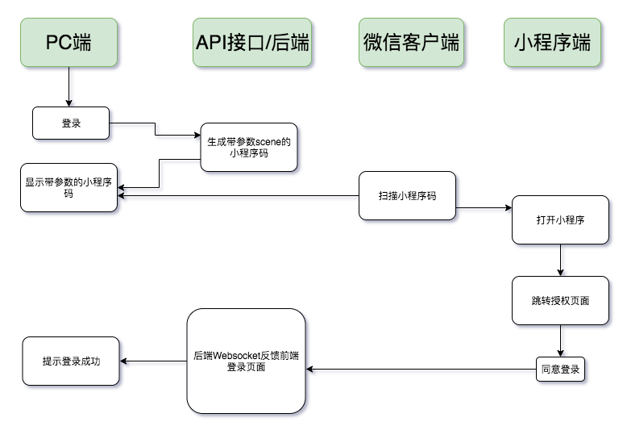

# 基于Laravel、Swoole实现微信小程序登录授权
>基于微信小程序登录授权机制延伸第三方平台使用(Websocket方式实现)

## 在线体验

[微信小程序登录平台](https://auth.icharle.com/)

## 环境依赖

* php>7.1
* swoole 
* redis

## 实现原理

>实现思路：借用微信小程序中个人开发者使用微信授权登录的功能，再结合微信小程序中B接口生成带参数的小程序码，用户只需扫描小程序码即可进入微信小程序中，再微信小程序中实现登录逻辑以及登录反馈信息。技术上PC端等待反馈登录逻辑信息采用Websocket方式主动推送消息，抛弃采用ajax轮询方式实现，大大提高性能。同时PC端Websocket会话ID及其对应的场景值采用Redis存储，减少数据库压力。



## 安装使用

```
# 从仓库中下载
$ git clone https://github.com/icharle/WechatAuthorization.git

# 进入代码根目录安装依赖
$ composer install

# copy .env文件
$ cp .env.example .env

# 配置数据库相关

# 生成项目key
$ php artisan key:generate

# 生成JWT key
$ php artisan jwt:secret

# 修改.env文件配置微信小程序appID && appSecret
$ WX_APPID = 
$ WX_SECRET = 

# 公开storage/public文件夹
$ php artisan storage:link

# 更改Websocket监听端口
$ 修改app/Console/Swoole.php中第71行，默认为9502端口

# 配置SSL证书，实现wss://xxx.xxx 
  
  # 第①中方法： 原理：通过swoole配置SSL证书  Websocket链接则为:wss://xxx.xxx:9502
    $ 修改app/Console/Swoole.php中注释71行、并且取消注释66-70行代码
    $ 修改app/Console/Swoole.php中第68、69行，放置自己域名的证书
  
  # 第②中方法：(默认实现) 原理：nginx配置SSL证书，通过nginx反向代理websocket实现  Websocket链接则为:wss://xxx.xxx/websocket
    $ location /websocket {  # websocket可以随意修改(自定义值)
    $         proxy_pass http://127.0.0.1:9502; # 9502改为你在swoole中监听的端口
    $         proxy_http_version 1.1;
    $         proxy_set_header X-Real-IP $remote_addr;
    $         proxy_set_header Host $host;
    $         proxy_set_header X-Forwarded-For $proxy_add_x_forwarded_for;
    $         proxy_set_header Upgrade $http_upgrade;
    $         proxy_set_header Connection "Upgrade";
    $         proxy_set_header X-Real-IP $remote_addr;
    $ }
    
# 启用Websocket并常驻内存(建议用Supervisor 守护进程)
$ php artisan swoole start
```
